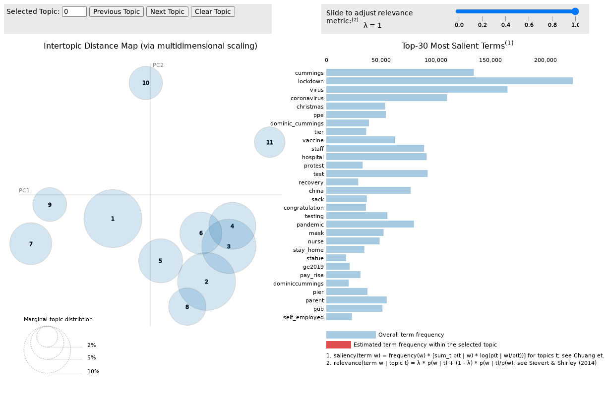

# BoJo-tweets
An in-depth analysis of all tweets mentioning "@BorisJohnson" over 2019 and 2020. 

## Getting started
If you want to run the notebooks yourself, there are certain packages that might need installing.
```
pip install snscrape==0.3.4
pip install wordcloud==1.8.1
pip install gensim==3.8.3
pip install flair==0.7
pip install textblob==0.15.3
pip install vaderSentiment==3.3.2
```
To scrape the data from scratch takes a very long time with `snscrape`. 

## Data
The data fetched is all tweets which mention the user @BorisJohnson, between 1st January 2019 and 31st January 2020. In 
total there are around 14.6 million tweets, distributed as follows:


For a deeper look at the data, like the most common region of tweeters in our dataset and the number of users mentioned,
see the [basic exploratory analysis notebook](2.%20Explore.ipynb).

## Topic modelling
A lot has happened over 2019 and 2020:
* The original Brexit deadline was 29 March 2019 (it was delayed)
* Boris was elected Prime Minister on 24 July 2019, following May's resignation
* Another Brexit deadline on 31 October 2019 (it was delayed, again)
* Conservatives won the general election on 12 December 2019
* In March 2020 the COVID-19 pandemic hit the UK, with a first national lockdown announced on 16 March 2020
* Boris Johnson tested positive for coronavirus in late March, and in early April 2020 spend some time in intensive care
* In late May 2020 the news that Boris' Chief Adviser, Dominic Cummings, clearly broke lockdown rules swept over the 
nation
* In June 2020, BLM protests were held in major cities in the UK and US
* Towards the end of 2020 COVID vaccines began to be rolled out

### Model choice
I've trained a [Latent Dirichlet Allocation (LDA)](https://en.wikipedia.org/wiki/Latent_Dirichlet_allocation) model to 
try and capture the key topics in this text corpus. LDA models can be seen a kind of "soft clustering" where documents 
can consist of several topics with different weights (rather than hard clustering algorithms where a data point is 
assigned to a particular cluster eg. K-means). 

LDA is a popular topic modelling algorithm, which reduces a bag-of-words model to a small number of "topics" each with
different keyword weightings - so it carries with it a dimensionality reduction characteristic. Since it is built into
`gensim` LDA models as a readily usable method, the [coherence score](https://datascienceplus.com/evaluation-of-topic-modeling-topic-coherence/) 
has been used to evaluate the model performance. In general it is difficult problem to evaluate the performance of 
unsupervised machine learning methods.

### Topics
The optimal number of topics in this dataset was chosen to be 11, according to the coherence score. Below is an 
intertopic map, which can be used to visualise the word embedding overlap between these topics.

<p align="right">
  
</p>



Visually inspecting the keywords for these topics (listed explicitly in Notebook 3), there are mostly clear human
interpretations arising:
1. Coronavirus testing / Science
2. International and Domestic policies
3. Brexit
4. Election-related #BackBoris (positive)
5. Lockdown (masks, pubs)
6. Election-related #LiarJohnson (negative)
7. Lockdown (stay home, essential travel)
8. Christmas Vaccine
9. Hospitals / Hygiene
10. Dominic Cummings
11. Black Lives Matter protests


The plot below shows how these topics evolve over time, by plotting the most dominant topic's contribution each day:


Some interesting things showed up, like the fact "statue" is one of the highest-scoring keywords in the BLM topic #11.
People who were tweeting about these protests were also tweeting a lot about statues. [I wonder why.](https://en.wikipedia.org/wiki/Statue_of_Edward_Colston#Toppling_and_removal)

Also, the most focused topic award goes to Dominic Cummings, it definitely contains the least spillover into other 
topics. The top 10 key words are all directly related to his drive to Durham. The top keywords are:
`cummings, dominic_cummings, sack, dominiccummings, lockdown, parent, drive, dom, mile, durham`.

There are two topics which are election-related. One of them captures the Twitter hashtag 
_#BackBoris_ and contains other positive keywords such as `congratulation, unite, mandate, nh_billion, backboris, congrats, victory` 
where `nh_billion` is a processed version of phrases to do with funding the NHS. This topic is more dominant in the 
build-up to the Tory leadership election.

The other election-related topic captures the _#LiarJohnson_ hashtag as well as keywords such as `ge2019, hospital, nurse, scrutiny, coward, liarjohnson, marr, poverty` 
and here `marr` refers to Boris' [appearance](https://www.bbc.co.uk/news/av/uk-politics-21916721) on the Andrew Marr show.
This topic is more dominant around the general election in 2019.

Despite some of the topics having obvious human interpretations, others are less clear-cut. For example, there are two or
three topics with keywords surrounding "coronavirus", but each time there are different secondary keywords which indicate 
where the coronavirus conversation has changed over time. In the early stages of the lockdown, everyone was talking about 
"essential travel", "staying home" and "Italy", whereas in the later stages of 2020 the conversation shifted more to be 
about "masks", "pubs" (classic UK) and "teachers".

## Sentiment analysis
Another thing we can take a look at with this natural language dataset is the __sentiment__ of the tweets, that is, 
how positive or negative are the emotions expressed in tweets mentioning Boris Johnson?
 
### Model choice
There are popular and powerful sentiment classifiers already pretrained and open-sourced. I explored three of them,
`textblob`, `vader` and `flair` and also trained my own using flair's embedding layers. 

To train a classifier you need labels (since this time it is a supervised problem!), which we don't have in our main
twitter dataset. However, you can still fine-tune a text classifier to tweet inputs by leveraging this 
[Kaggle dataset](https://www.kaggle.com/kazanova/sentiment140) which contains 1.6 million __labelled__ tweets 
(0=negative, 1=positive).
 
After training a sentiment classifier using this dataset, built on top of flair's BERT-based `TextClassifier`, we 
__do achieve significantly better predictions__. However, the cost of these better predictions is that the amount of 
computation time it takes to actually make predictions is crazy - it would take days to classify all of the Boris tweets.

As a compromise, I opted to use the second most powerful classifier in my list, which was the RNN-based out-of-the-box 
Flair text classifier.

If you are interested, I kept the model comparison table inside notebook 4.

### Sentiment scores

Using the model above, every tweet in our dataset was given a score between -1 (negative sentiment) and +1 (positive 
sentiment). For visualisation purposes, I created daily summary information such as the mean sentiment of 
tweets in a single day, the distribution of sentiment in a single day, the 100 most positive/negative tweets in a day etc.

On average, the sentiment of tweets which mention Boris Johnson are __negative__ (mean score of -0.22).


One interesting thing we can do is take a look at the daily sentiment at the start of the lockdown, and see what happens.
There was a few things happening around this time, in particular Boris Johnson tested positive for coronavirus and at
one point needed to be admitted to hospital and placed in intensive care.

Some observations on this plot:
* When first testing positive, there was a spike in positive tweets. Lots of these tweets mentioned things like "get well soon",
and mentioning encouraging phrases about recovery.
* There was an even bigger spike when he was moved into intensive care, and in fact this is the actually the most 
positive public sentiment has been towards Boris Johnson over the last two years!
* After leaving hospital, Boris Johnson retreated to his country home to finish recovery. During this period of time, 
the sentiment of tweets was actually more negative than average.

### Further sentiment plots
A lot of the sentiment scores contain extreme values, so it can be useful to look at the distribution of sentiment over 
time. Here, the mid-value is not mean but is instead the median (50% quantile). Similar trends appear as in the first 
plot above.


We can also categorise the tweets based on their sentiment score as an "intensity" measure. Here, if the tweet has a score 
of greater than 0.9, it is considered 'very positive', whereas if the score is between 0 and 0.7 it is only 'weak positive'.
The same goes for negative tweets, with negative scores (-0.9, -0.7, 0).

<p align="center">
  
</p>

Notice how the "very negative" tweets are much more common (around 25% of all tweets) than the "very positive" tweets, 
which only account for around 15% of all tweets.

### Sentiment WordClouds
One last plot I decided to look at was a Word Cloud for each of the top 100 positive / negative tweets each day. Word 
clouds are handy visualisations for seeing at a glance what everyone is talking about.

I created the plots and saved them to this repo for every quarter in 2019 and 2020, but below I'll only put down a couple
of interesting ones.

Here is 2019 Q4 (note the themes about brexit, the upcoming general election, and the fact people say "blah blah" a lot 
on the negative cloud).


Here is the 2020 Q1 word cloud - the themes have changed slightly:


## Future analysis
This is all I've decided to do for the first iteration of analysis, but in the future I am considering looking into 
anomaly detection using the clustering approach explained in [this article](https://medium.com/swlh/anomaly-detection-in-tweets-clustering-proximity-based-approach-58f8c22eed1e) -
but I don't know what sort of interesting anomalies I'd detect from this data. So there probably won't be any 
further analysis for now.